# Advanced Lane finding project

The goals / steps of this project are the following:

* Compute the camera calibration matrix and distortion coefficients given a set of chessboard images.
* Apply a distortion correction to raw images.
* Use color transforms, gradients, etc., to create a thresholded binary image.
* Apply a perspective transform to rectify binary image ("birds-eye view").
* Detect lane pixels and fit to find the lane boundary.
* Determine the curvature of the lane and vehicle position with respect to center.
* Warp the detected lane boundaries back onto the original image.
* Output visual display of the lane boundaries and numerical estimation of lane curvature and vehicle position.

### Camera Calibration

There are a total of 20 images provided in this project for camera calibration.Let's look at one of the image.

We can see that there are 9 corners in x row wise and 6 columns column wise. I will use the below function `get_imagepoints()` to read all calibration images using glob and find the object points and image points for all the images.
Here I am assuming the chessboard is fixed on the (x, y) plane at z=0, such that the object points are the same for each calibration image.  Thus, `objp` is just a replicated array of coordinates, and `objpoints` will be appended with a copy of it every time I successfully detect all chessboard corners in a test image.  `imgpoints` will be appended with the (x, y) pixel position of each of the corners in the image plane with each successful chessboard detection.  

I then used the output `objpoints` and `imgpoints` to compute the camera calibration and distortion coefficients using the `cv2.calibrateCamera()` function.  I applied this distortion correction to the test image using the `cv2.undistort()` function

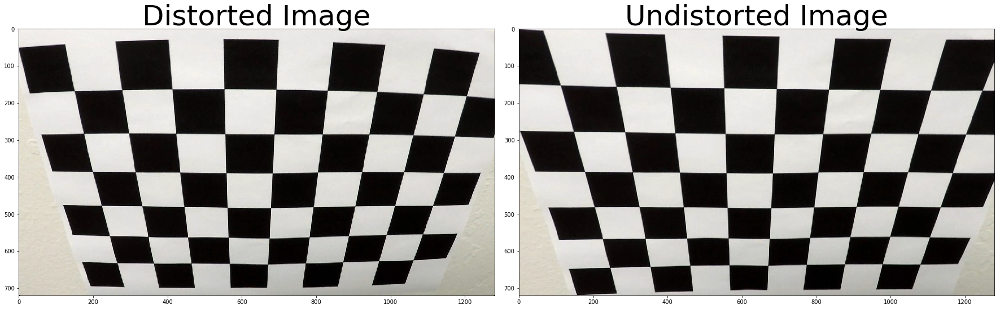

## Gradient and Color transforms

Let's visualize an image in RGB channels and HLS channels.

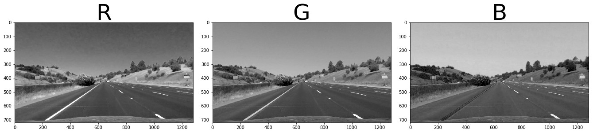

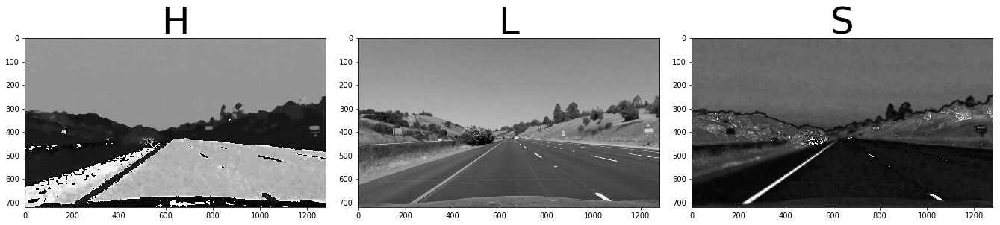

The lane lines from the S channel stand out very clearly. I will be using a combination of S and R channel to create a binary image.Lets apply a color threshold on R and S channel and see the output.

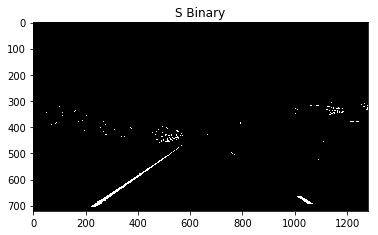

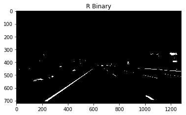

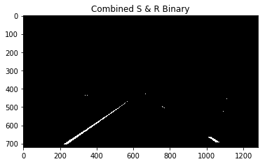

Here the lane lines are standing out but it may not be the same case when there is a different lightning condition or the color of lane line has become dull. So i have decided to use a combination of color and gradient threshold(x grad, y grad, absolute grad and direction grad).After experimenting with the threshold values i found the threshold values: `(30,100) for grad x` , `(50,100) for grad y`, 
`(30,100) for magnitude grad` and `(0.8,1.2) for direction grad` and a `kernel size of 3` to work fine for this project.

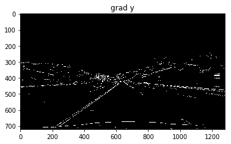

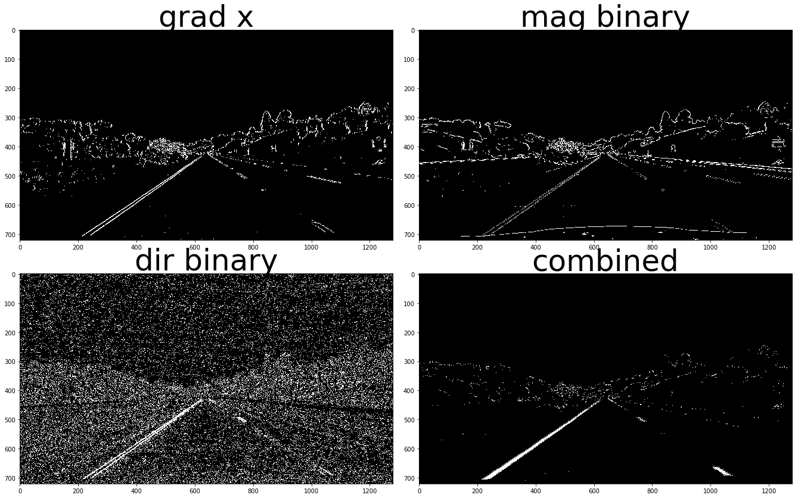

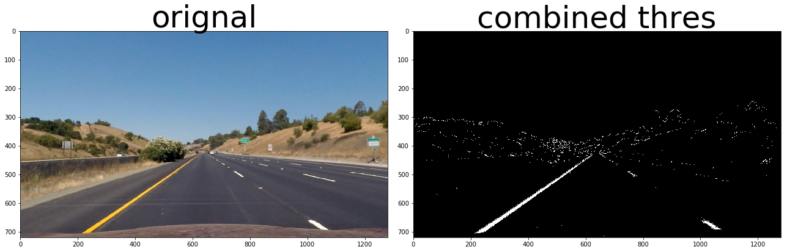

### Perspective Transform

I choose the 4 source points and the destination points intutively by forming a polygon on the lanes.After many trail and error i decided to choose these source and destination points as they yielded good results.

| Source        | Destination   | 
|:-------------:|:-------------:| 
| 573, 474      | 400, 100      | 
| 750, 475      | 1050, 100     |
| 1087, 676     | 1087, 720     |
| 300, 677      | 300, 720      |
The polygon with these vertices is drawn on the image for visualization. Destination points are chosen such that straight lanes appear more or less parallel in the transformed image.

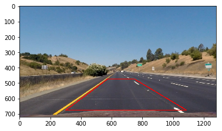

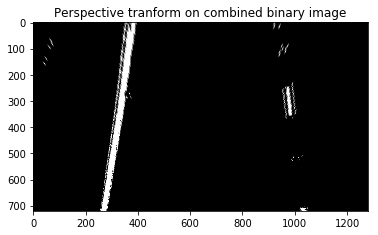

## Finding the lane pixels

From the plot of histogram we can guess where the lanes are.We can guess from the peaks of the histogram where the lanes will be because after thresholding and warping there will be maximum pixels on the position of lanes.
We can find a midpoint of the image and search for peaks on left and right of the midpoint to find the base positions of left and right lanes. From the base points I use a sliding window, placed around the line centers, to find and follow the lines up to the top of the frame.
I have used 9 windows of height 80 pixels.

The x & y coordinates of non zeros pixels are found, a polynomial is fit for these coordinates to draw the lane lines.

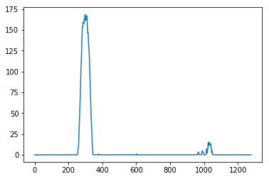

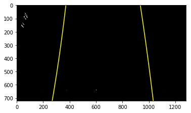

### Calculating radius of curvature of the lane and the position of the vehicle with respect to center.

I am calculating the radius of curvature in meters by the method given in classroom material.A pixel to meter conversion is used and the fits are calculated again.

To find the position of vehicle with respect to center, the center of image gives the position of car and to find the center of the lane we can calculate mean of the lane pixels closest to the car.The difference between the two will give us the measure of how much the car is left/right of the center.The difference obtained will be in pixels we need to convert them into meters. The code to calculate car's position is present on line 48-52 in `mypipeline()`

    Radius of curvature 5794.876332311366
    Center offset  0.05720668055097083 m
    

### Plotting the result back on the road

For this step i have used the code provided by Udacity. The inverese tranformation matrix which was created before will be used here.

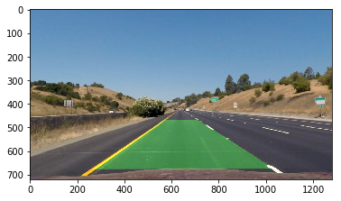

## Pipeline

A pipeline named `mypipeline()` is created and an image is passed to it.The functions discussed above are called from this pipeline. The object points, image points for calibration along with camera matrix , distortion coefficients , tranformation matrix and inverse tranformation matrix are calulated before the pipeline because they will be same for all the images and recomputation will result in more processing time. 

Here's a [link to my video result](./project_video.mp4)

## Discussion

The pipeline works well for the project video but it fails for the challenge video.The pipeline stops with an error because no lane lines were detected.
In my current pipeline i have used combination of R & S channel but combination of R and G can be used to detect yellow lines along with S channel. L channel can be included to remove the edges generated due to shadows.

**Improvements:**

* If a bad frame is detected then values from previous frames can be used.
* Smoothing can be done to get a cleaner result.
